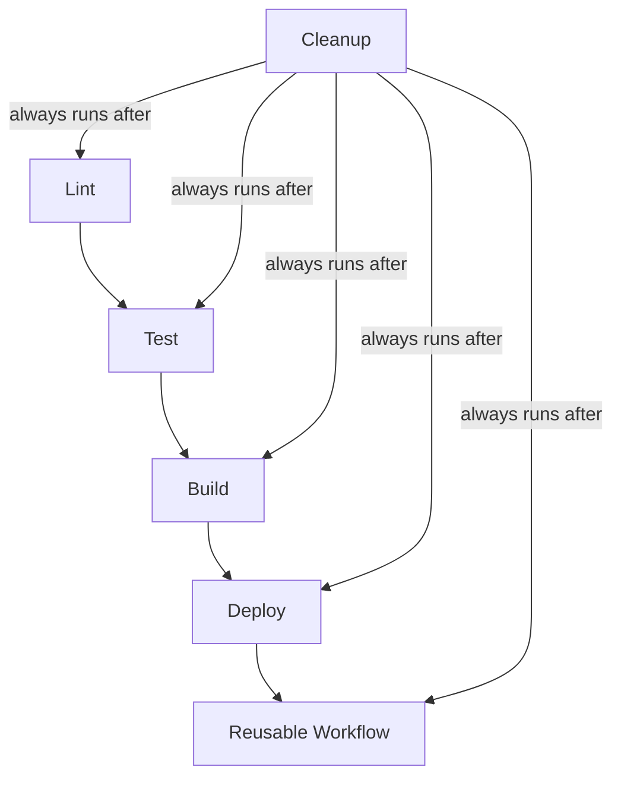

# GitHub Actions Advanced Workflow and Jenkins Project

This project demonstrates an advanced CI/CD pipeline using GitHub Actions with multiple jobs, dependencies, matrices, secrets management, and reusable workflows.
Implementation procedure as follows:


## Table of Contents
- [Features](#features)
- [Setup Instructions](#setup-instructions)
- [Workflow Overview](#workflow-overview)
- [Manual Deployment](#manual-deployment)
- [Environment Variables](#environment-variables)
- [Secrets Configuration](#secrets-configuration)
- [Troubleshooting](#troubleshooting)
- [Customization](#customization)

## Features

- **Multi-job Pipeline**: Lint → Test → Build → Deploy
- **Matrix Testing**: Cross-OS and Node version testing
- **Manual Triggers**: Deploy to different environments
- **Scheduled Jobs**: Daily midnight runs
- **Artifact Sharing**: Pass build outputs between jobs
- **Notifications**: Slack integration
- **Reusable Workflows**: Shared workflow components
- **Concurrency Control**: Prevent duplicate deployments

## Setup Instructions

### 1. Prerequisites
- GitHub repository
- Node.js project (or adapt for your stack)
- Slack workspace (for notifications - optional)

### 2. Add Workflow Files

1. Create `.github/workflows/main.yml` with the [advanced workflow content](#workflow-overview)
2. Create `.github/workflows/reusable.yml` for reusable components:

```yaml
name: Reusable Deployment Workflow

on:
  workflow_call:
    inputs:
      environment:
        required: true
        type: string
    secrets:
      api-token:
        required: true

jobs:
  deploy:
    runs-on: ubuntu-latest
    steps:
      - name: Deploy to ${{ inputs.environment }}
        run: |
          echo "Deploying to ${{ inputs.environment }}"
          echo "Using token ${{ secrets.api-token }}"
```

### 3. Configure Secrets

Go to Repository Settings → Secrets → Actions:
- `PRODUCTION_TOKEN`: Your deployment API token
- `SLACK_WEBHOOK`: Slack incoming webhook URL (optional)

## Workflow Overview

### Trigger Events
- **Push** to `main` branch
- **Pull Requests** to `main` branch
- **Scheduled**: Daily at midnight UTC
- **Manual**: Through GitHub UI

### Jobs Execution Flow



### Detailed Job Breakdown

1. **Lint**
   - Checks out code
   - Caches node_modules
   - Runs linter
   - Outputs status for downstream jobs

2. **Test** (Matrix Strategy)
   - Runs on Ubuntu & Windows
   - Tests with Node 18 & 20
   - Uploads coverage reports
   - Sends Slack alerts on failure

3. **Build**
   - Creates production build
   - Uploads build artifacts

4. **Deploy**
   - Protected environment
   - Manual or automatic triggers
   - Environment-specific deployment
   - Post-deployment verification

5. **Reusable Workflow**
   - Example of workflow reuse
   - Shares deployment logic

6. **Cleanup**
   - Always runs
   - Cleans temporary files
   - Reports final status

## Manual Deployment

To trigger a manual deployment:

1. Go to **Actions** tab
2. Select **Advanced CI/CD Pipeline**
3. Click **Run workflow**
4. Choose environment:
   - `staging` (default)
   - `production`
5. Click **Run workflow**

## Environment Variables

| Variable | Purpose | Default |
|----------|---------|---------|
| `NODE_ENV` | Node environment | `production` |
| `CI` | CI environment flag | `true` |

## Secrets Configuration

| Secret | Required | Purpose |
|--------|----------|---------|
| `PRODUCTION_TOKEN` | Yes | Deployment authentication |
| `SLACK_WEBHOOK` | No | Failure notifications |

## Troubleshooting

### Common Issues

1. **Workflow not triggering**
   - Check branch filters in `on:` section
   - Verify file is in `.github/workflows/`

2. **Permission errors**
   - Verify repository secrets are properly set
   - Check environment protection rules

3. **Matrix job failures**
   - Review OS-specific test configurations
   - Check Node version compatibility

### Debugging Steps

1. View workflow run logs
2. Check artifact uploads/downloads
3. Verify secret availability in environment

## Customization

### For Node.js Projects
- Update `node-version` matrix
- Adjust `npm` scripts in workflow steps

### For Other Stacks
1. Replace Node setup with:
   - `actions/setup-python` for Python
   - `actions/setup-java` for Java
   - etc.

2. Update build/test commands

### Adding More Features
- **Docker Support**: Add build/push steps
- **Database Migrations**: Pre-deployment scripts
- **Multi-environment**: Add staging/prod separation

## License

This workflow template is [MIT licensed](LICENSE).
```

This README provides:
1. Clear setup instructions
2. Visual workflow explanation
3. Detailed job documentation
4. Troubleshooting guide
5. Customization options
6. Badge for build status

Adjust the content to match your specific project requirements, and consider adding:
- Screenshots of the workflow in action
- Links to your specific deployment documentation
- Team-specific troubleshooting notes
- Additional environment-specific configurations
